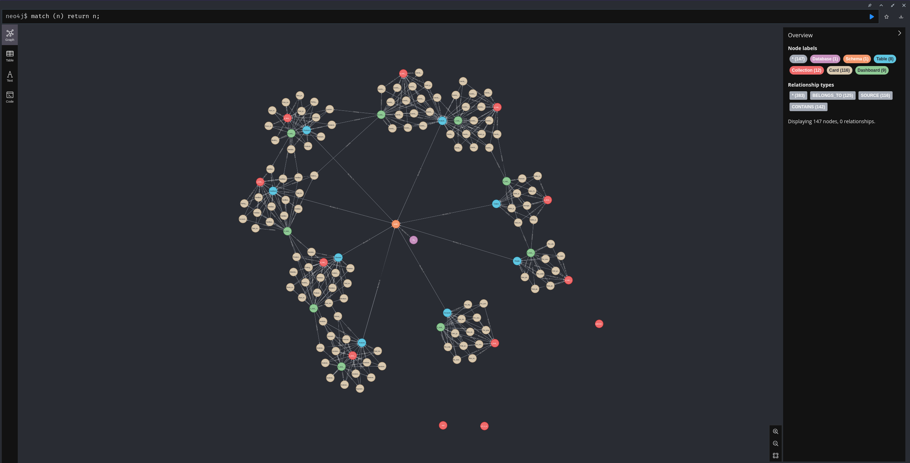
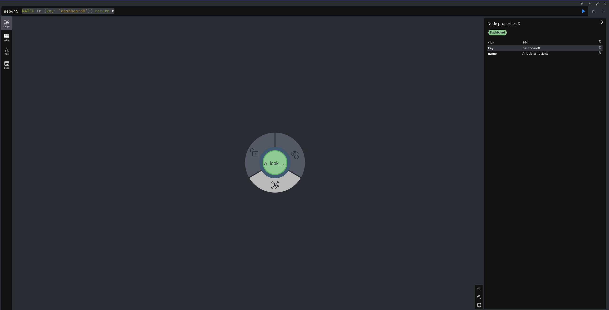
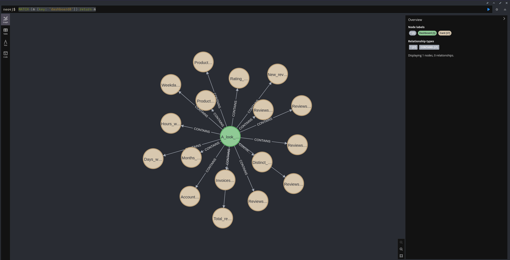
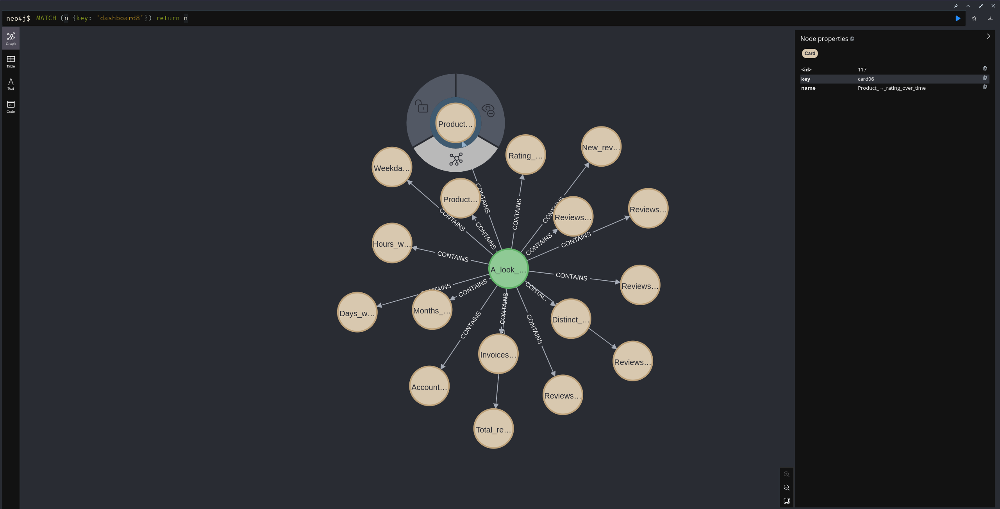
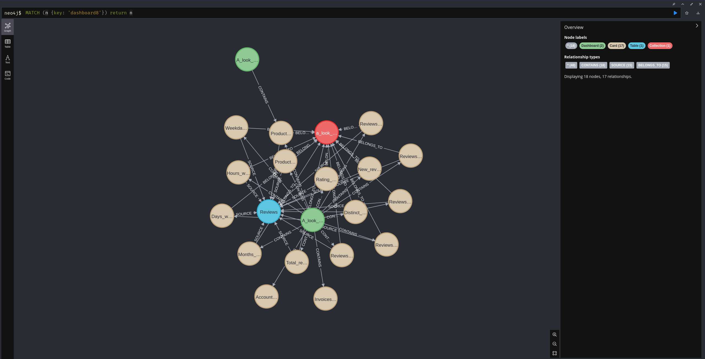

# MetaGraph

An admin's tool to get quick information about your instance entities like databases, fields, collections, cards and dashboards



## How to run

1) install Python
2) install dependencies with pip3 install -r metagraph/requirements.txt
3) configure the environment variables: user & password, or session_cookie in case you use sso, and host
4) run python metagraph/main.py cypher

You'll get a metagraph.cypher file that you can enter in a Neo4j database to visualize the dependencies

## Questions

### Why Neo4j

A graph database will allow you to do impact analyses like: "what happens if I delete a certain card?" or "which cards are connected to a dashboard?"

### I have SSO enabled, I can't use a simple user/pass authentication

Simply enter the session token as an environment variable and run the program as:

```
session_token=xxxxx python main.py cypher
```

### I want to know the fields of each table

Simply pass the --fields argument to the script. I added this but it's not being used at all, for now

### I want to get only the cards from a single database

Use the --database-list parameter, which accepts as a parameter a comma separated list of databases. For example, if you use "--database-list 1,3,5,10", it will get only the questions from those databases only (please take into account that this won't make the process faster, it only ignores the questions from those databases when it runs)

### The script ignores the archived cards

Starting from the new version (Jan-2024), the script does not write the cards on the archive. If you want to get which cards are archived, use the flag --no-skip-archived

## How to visualize a node chart in Neo4j

```
Match (n)-[r]->(m) Return n,r,m;
```

## How do I run a Neo4j database locally

Simply do 

```
docker run --rm -it -p 7474:7474 -p 7687:7687 -e NEO4J_AUTH=none neo4j:5.12.0
```

and go to localhost:7474 (no authentication)

NOTE: if you run `python metagraph/main.py neo4j` the script will connect to the neo4j database and insert the nodes automatically. No need to copy and paste the cypher

## How do I track dependencies?

After you populated the neo4j db, you can run queries like:

`MATCH (n {key: 'dashboard8'}) return n`

(dashboard8 is dashboard with the ID of 8 inside Metabase, so change it to anything you want here: table, card, collection)

...and you'll get the single node you're looking for. From there you can start navigating the graph to see the dependencies






## LIMITATIONS:
- can't parse questions with snippets
- can't parse questions with CTEs

# To do
- Dockerize this
- Add tests
- Probably many refactors
- track better the references to cards, e.g. we can track if the card references are {{#something}}, but we don't when cards have variations of this
- the sqlglot library doesn't parse very well when there are foreign data wrappers or comments
- ignore questions that are from mongodb or h2, we're ignoring if there are databases of these types, but we don't ignore the questions